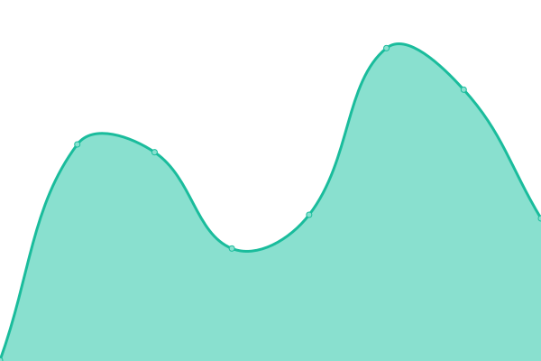
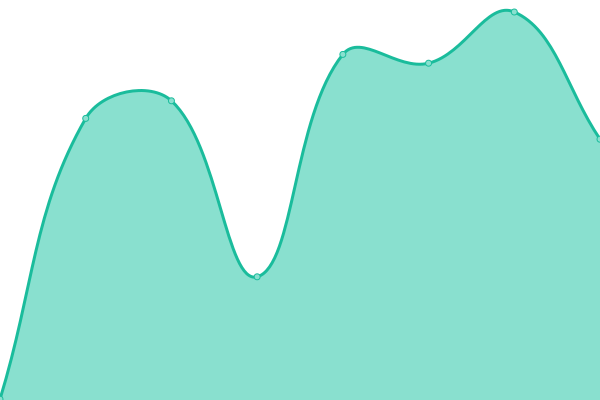
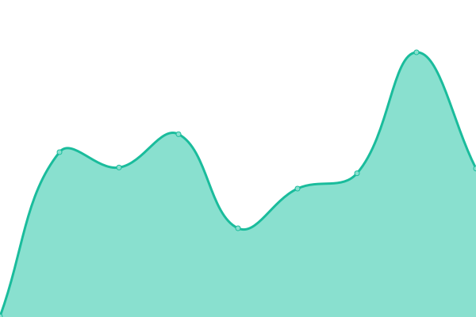

# [📈 Live Status](https://chaves26.github.io/Monitoreo_upptime): <!--live status--> **🟩 All systems operational**

This repository contains the open-source uptime monitor and status page for [Aldahir Chaves Mora](https://chaves26.github.io/Monitoreo_upptime), powered by [Upptime](https://github.com/upptime/upptime).

With [Upptime](https://upptime.js.org), you can get your own unlimited and free uptime monitor and status page, powered entirely by a GitHub repository. We use [Issues](https://github.com/chaves26/Monitoreo_upptime/issues) as incident reports, [Actions](https://github.com/chaves26/Monitoreo_upptime/actions) as uptime monitors, and [Pages](https://chaves26.github.io/Monitoreo_upptime) for the status page.

<!--start: status pages-->
<!-- This summary is generated by Upptime (https://github.com/upptime/upptime) -->
<!-- Do not edit this manually, your changes will be overwritten -->
<!-- prettier-ignore -->
| URL | Status | History | Response Time | Uptime |
| --- | ------ | ------- | ------------- | ------ |
|  [Muni.cr](https://www.munis.cr) | 🟩 Up | [muni-cr.yml](https://github.com/Chaves26/Monitoreo_upptime/commits/HEAD/history/muni-cr.yml) | 

 564ms
     
 | 

<a href="https://chaves26.github.io/Monitoreo_upptime/history/muni-cr">100.00%</a>
    

|  [La Cruz](https://lacruz.munis.cr/usuario/login) | 🟩 Up | [la-cruz.yml](https://github.com/Chaves26/Monitoreo_upptime/commits/HEAD/history/la-cruz.yml) | 

 301ms
     
 | 

<a href="https://chaves26.github.io/Monitoreo_upptime/history/la-cruz">100.00%</a>
    

|  [Carrillo](https://carrillo.munis.cr/usuario/login) | 🟩 Up | [carrillo.yml](https://github.com/Chaves26/Monitoreo_upptime/commits/HEAD/history/carrillo.yml) | 

 1619ms
     
 | 

<a href="https://chaves26.github.io/Monitoreo_upptime/history/carrillo">100.00%</a>
    

|  [Abangares](https://abangares.munis.cr/usuario/login) | 🟩 Up | [abangares.yml](https://github.com/Chaves26/Monitoreo_upptime/commits/HEAD/history/abangares.yml) | 

 224ms
     
 | 

<a href="https://chaves26.github.io/Monitoreo_upptime/history/abangares">100.00%</a>
    

<!--end: status pages-->

[**Visit our status website →**](https://chaves26.github.io/Monitoreo_upptime)

## 📄 License

- Powered by: [Upptime](https://github.com/upptime/upptime)
- Code: [MIT](./LICENSE) © [Aldahir Chaves Mora](https://chaves26.github.io/Monitoreo_upptime)
- Data in the `./history` directory: [Open Database License](https://opendatacommons.org/licenses/odbl/1-0/)
